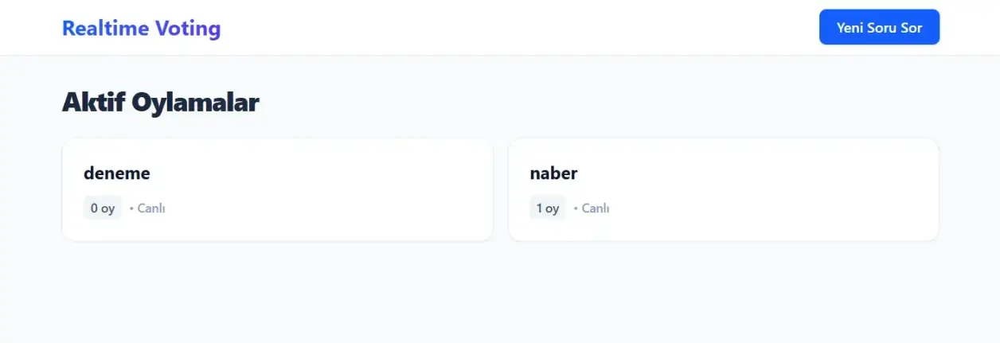
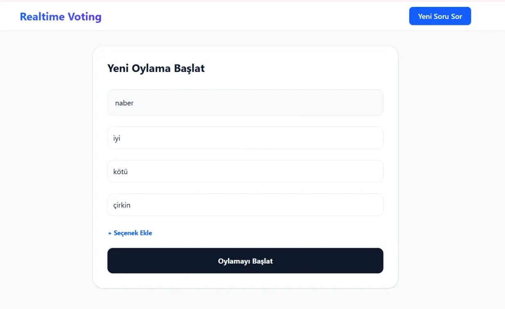
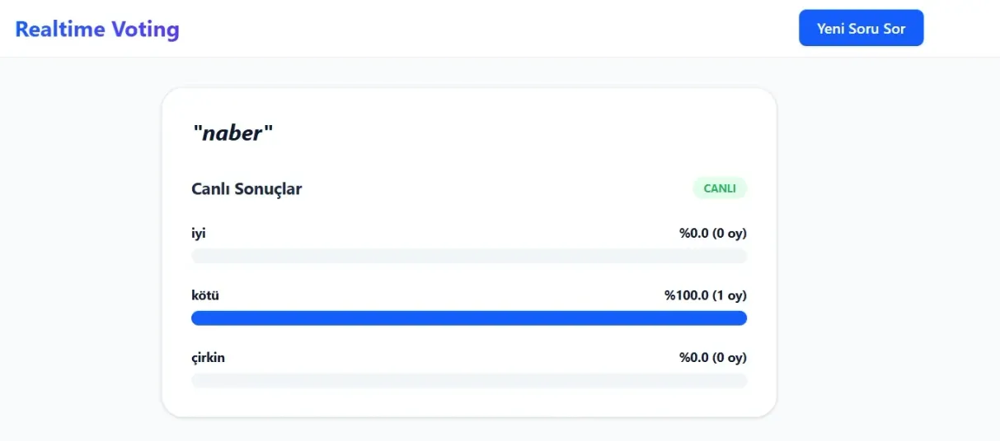

# Realtime-Voting-App

React 19 • Vite 7 • Tailwind CSS v4 • GraphQL • Node.js (Express) • Apollo Server App

---





---

Bu proje, **GraphQL Subscriptions** teknolojisi kullanılarak geliştirilmiş, tamamen **gerçek zamanlı** bir oylama (anket) uygulamasıdır. Kullanıcılar sayfayı yenilemeden yeni anketleri görebilir, oy kullanabilir ve sonuçların değişimini canlı olarak izleyebilirler.

### 🚀 Özellikler

- **Gerçek Zamanlı Soru Akışı:** Yeni bir anket oluşturulduğunda tüm kullanıcıların ekranına anında düşer.
- **Canlı Sonuç Takibi:** Kullanılan oylar, yüzdeler ve bar grafikleri WebSocket üzerinden anlık olarak güncellenir.
- **Dinamik Seçenek Yönetimi:** Soru oluştururken sınırsız sayıda seçenek eklenebilir.
- **Modern Arayüz:** Tailwind CSS v4 ile geliştirilmiş, tamamen responsive ve yüksek performanslı tasarım.
- **Güçlü Abonelik Altyapısı:** `graphql-ws` ve Apollo Subscriptions ile kesintisiz veri akışı.

### 🛠️ Teknoloji Yığını

- **Frontend:** React 19 (Vite 7), Apollo Client 3
- **Styling:** Tailwind CSS v4
- **Backend:** Node.js, Express, Apollo Server 5
- **Protokol:** GraphQL (Query, Mutation, Subscription), WebSocket (`graphql-ws`)
- **Yönlendirme:** React Router 7

### 📋 Gereksinimler

- Node.js (v18+)
- npm veya yarn

### 🔧 Kurulum ve Çalıştırma

#### 1️⃣ Sunucuyu (Backend) Başlatın

```bash
cd server
yarn install
yarn start
```

Sunucu varsayılan olarak aşağıdaki adreste çalışır:

```
http://localhost:4000/graphql
```

#### 2️⃣ Uygulamayı (Frontend) Başlatın

```bash
cd client
yarn install
yarn dev
```

Uygulama varsayılan olarak aşağıdaki adreste çalışır:

```
http://localhost:5173
```

---

This project is a fully **real-time voting (polling) application** built using **GraphQL Subscriptions**. Users can see new polls instantly, cast votes, and watch results update live without refreshing the page.

### 🚀 Features

- **Real-Time Poll Stream:** Newly created polls appear instantly on all connected clients.
- **Live Result Tracking:** Votes, percentages, and progress bars update in real time via WebSockets.
- **Dynamic Option Management:** Create polls with an unlimited number of options.
- **Modern Interface:** A fully responsive, high-performance UI powered by Tailwind CSS v4.
- **Robust Subscription Layer:** Seamless real-time data flow using `graphql-ws` and Apollo Subscriptions.

### 🛠️ Tech Stack

- **Frontend:** React 19 (Vite 7), Apollo Client 3
- **Styling:** Tailwind CSS v4
- **Backend:** Node.js, Express, Apollo Server 5
- **Protocols:** GraphQL (Query, Mutation, Subscription), WebSocket (`graphql-ws`)
- **Routing:** React Router 7

### 📋 Requirements

- Node.js (v18 or higher)
- npm or yarn

### 🔧 Installation and Setup

#### 1️⃣ Start the Server (Backend)

```bash
cd server
yarn install
yarn start
```

The server runs by default at:

```
http://localhost:4000/graphql
```

#### 2️⃣ Start the Application (Frontend)

```bash
cd client
yarn install
yarn dev
```

The application runs by default at:

```
http://localhost:5173
```

---

[Patika GraphQL Project-3](https://academy.patika.dev/courses/graphql/project-03)

[Patika](https://academy.patika.dev/tr/@alpk)
